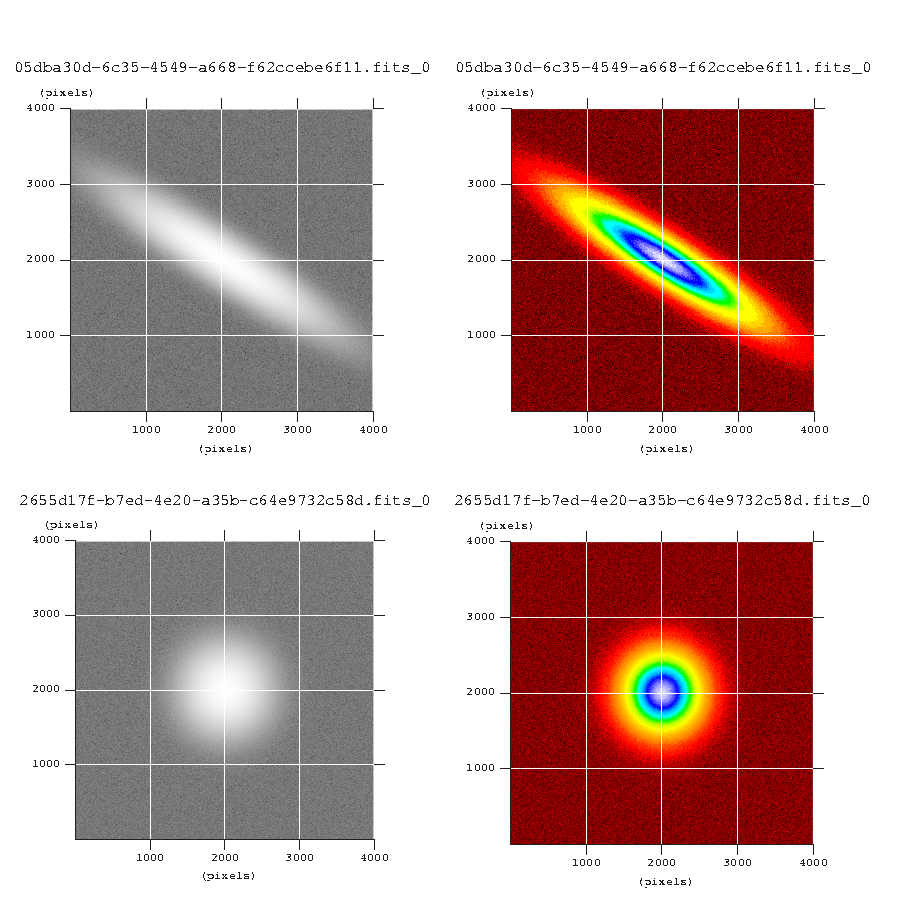

 

# radiosource

> generate pseudorandom radio sources with [Astropy](https://www.astropy.org/)'s Gaussian2D modeling function

[](https://travis-ci.org/badges/badgerbadgerbadger)  

#### > *Disclaimer: This is not a scientific simulation but more a proof of concept on generating random radio sources*


### Requirements
  * Python 3
  * Numpy
  * Astropy
  * Matplotlib
### Installation

```python
pip3 install numpy
pip3 install astropy
pip3 install matplotlib
```
### Usage
```python
python3 radiosource.py -Amount
```


## Release History
* 1.2
    * ADD: pass amount as python script argument
* 1.1
    * ADD: Added `postprocessing.py` Automated post processing with fits coloring and export to image file
    * CHANGE: Adjusted random range of x_mean and y_mean from 80 to 50
* 1.0
    * initial commit
    
    

### To Do
- [x] Automate post processing
- [x] Export to img file (tiff,png,jpg)
- [ ] GUI

#### Example Imagery
 
 
